# Path tracing

Path tracing is a ray tracing algorithm that sends rays from the Camera and, when a ray hits a reflective or refractive surface, recurses the process until it reaches a light source. The series of rays from the Camera to the Light form a path.

It enables HDRP to compute various effects (such as hard or soft shadows, mirror or glossy reflections and refractions, and indirect illumination) in a single unified process.

A notable downside to path tracing is noise. Noise vanishes as more paths accumulate and converges toward a clean image. For more information about path tracing limitations in HDRP, see [Unsupported features of path tracing](Ray-Tracing-Getting-Started.md#unsupported-features-of-path-tracing).

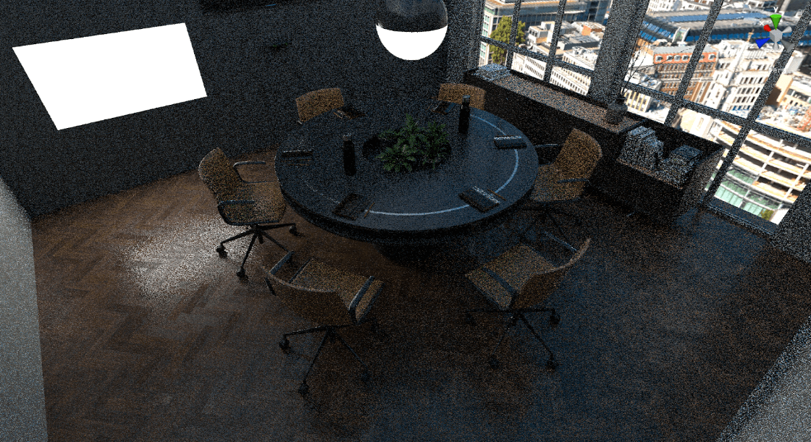

Noisy image with **Maximum Samples** set to 1

Clean image with **Maximum Samples** set to 256

The current implementation for path tracing in the High Definition Render Pipeline (HDRP) accumulates paths for every pixel up to a maximum count unless the Camera moves. If the Camera moves, HDRP restarts the path accumulation. Path tracing supports Lit, LayeredLit, Stacklit, AxF, and Unlit materials, and area, point, directional, and environment lights.

To troubleshoot this effect, HDRP provides a Path Tracing [Debug Mode](Ray-Tracing-Debug.md) and a Ray Tracing Acceleration Structure [Debug Mode](Ray-Tracing-Debug.md) in Lighting Full Screen Debug Mode.

## Setting up path tracing

Path tracing shares the general requirements and setup as other ray tracing effects, so for information on hardware requirements and set up, see [getting started with ray tracing](Ray-Tracing-Getting-Started.md). You must carry out this setup before you can add path tracing to your Scene.

## Adding path tracing to a Scene

Path tracing uses the [Volume](Volumes.md) framework, so to enable this feature, and modify its properties, you must add a Path Tracing override to a [Volume](Volumes.md) in your Scene. To do this:

1. In the Scene or Hierarchy view, select a GameObject that contains a Volume component to view it in the Inspector.
2. In the Inspector, select Add Override > Ray Tracing > Path Tracing.
3. In the Inspector for the Path Tracing Volume Override, check the Enable option. If you don't see the Enable option, make sure your HDRP Project supports ray tracing. For information on setting up ray tracing in HDRP, see [getting started with ray tracing](Ray-Tracing-Getting-Started.md). This switches HDRP to path-traced rendering and you should initially see a noisy image that converges towards a clean result.
4. If the image doesn't converge over time, select the drop-down next to the effect toggle and enable Always Refresh.

## Properties

| Property                    | Description                                                  |
| --------------------------- | ------------------------------------------------------------ |
| **Maximum Samples**         | Set the number of frames to accumulate for the final image. There is a progress bar at the bottom of the Scene view which indicates the current accumulation with respect to this value. |
| **Minimum Depth**           | Set the minimum number of light bounces in each path.        |
| **Maximum Depth**           | Set the maximum number of light bounces in each path. You can not set this to be lower than Minimum Depth.  **Note**: You can set this and Minimum Depth to 1 if you only want to direct lighting. You can set them both to 2 if you only want to visualize indirect lighting (which is only visible on the second bounce). |
| **Maximum Intensity**       | Set a value to clamp the intensity of the light value each bounce returns. This avoids bright, isolated pixels in the final result. **Note**: This property can make the final image dimmer, so if the result looks dark, increase the value of this property. |
| **Sky Importance Sampling** | Set the sky sampling mode. Importance sampling favors the brightest directions, which is beneficial when using a sky model with high contrast and intense spots (like a sun, or street lights). On the other hand, it can be slightly detrimental when using a smooth, uniform sky. It's active by default for HDRI skies only, but can also be turned On and Off, regardless of the type of sky in use. |
| **Denoising** | Enable this feature to denoise the output of the the path tracer. This feature is only available if the **Unity Denoising Package** is installed in your project. There are three available options in HDRP: 
- **None**: Disables denoising (this is the default option). 
- **Intel Open Image Denoise** : Performs denoising using the Intel Open Image Denoise library. 
- **NVIDIA OptiX** : Performs denoising using NVIDIA OptiX.  You can also enable two additional settings: 
- **Use AOVs** (Arbitrary Output Variables): Enable this option to increase detail retention after denoising. 
- **Temporal**: Enable this option to improve temporal consistency for denoised frame sequences. |

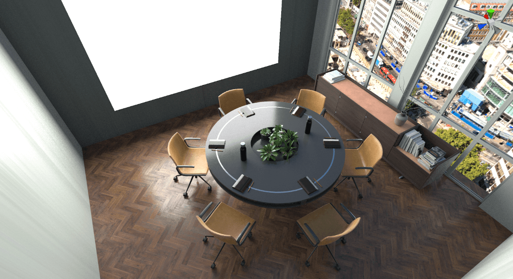

**Minimum Depth** set to 1, **Maximum Depth** set to 2: direct and indirect lighting (1 bounce)

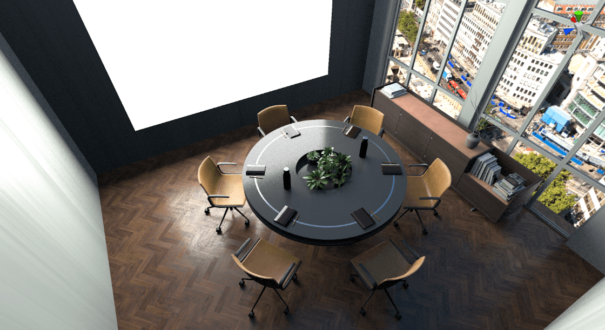

**Minimum Depth** set to 1, **Maximum Depth** set to 1: direct lighting only

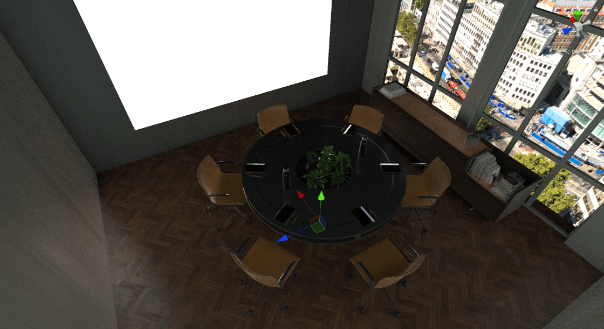

**Minimum Depth** set to 2, **Maximum Depth** set to 2: indirect lighting only (1 bounce)

## How path tracing affects Material properties

Path tracing changes how the following Material properties behave in your scene:

- [How transmissive objects absorb light](#surface-types)
- [How light refracts in transmissive objects](#refraction-models)
- [Subsurface scattering](#subsurface-scattering)

This is because path tracing in HDRP implements more precise light transport simulations than rasterization. To do this, path tracing computes all lighting effects and how light interacts with Materials at the same time. This changes the appearance of Materials in path-traced scenes. For example, in the images below, the Material appears darker.

The images below display the difference between transparent, double-sided materials in a rasterized and a path-traced scene:

GameObjects without path tracing (rasterized).

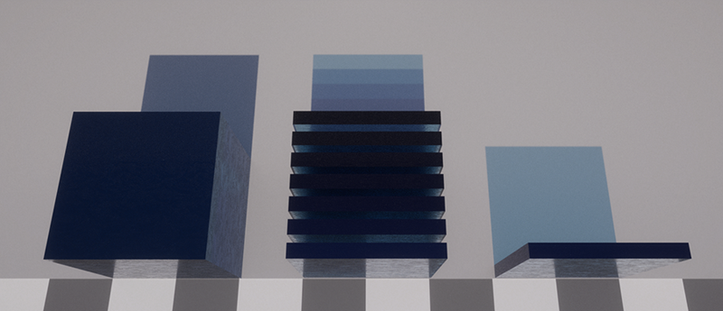

GameObjects with path tracing enabled.

## Path tracing and double-sided materials

When you use path tracing, the **Double-Sided** property (menu: **Inspector** > **Surface Options** > **Double-Sided**) allows transparent materials to accumulate correctly. If you disable **Double-sided** property, rays which exit the GameObject will not behave correctly.

The following images display the same GameObjects with a single-sided Material and a double-sided material:

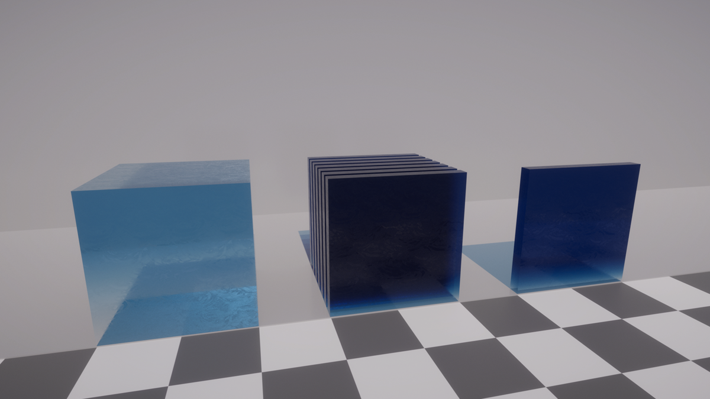

GameObjects with a single-sided Material and path tracing enabled

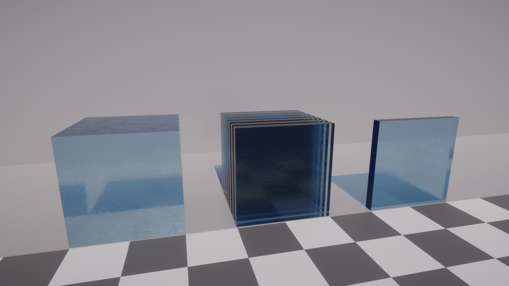

GameObjects with a double-sided Material and path tracing enabled

## How path tracing affects refraction models

Path tracing changes the way refraction models on a Lit Material behave.

To change the refraction model a Lit Material uses, in the **Transparency Inputs** section, select a model from the **Refraction model** dropdown, displayed in the following image:

The following table describes how each refraction model behaves when you enable path tracing:

| **Refraction model**   | **Path tracing behavior**                                    | **Compatible Surface sides**                                 |
| ---------------------- | ------------------------------------------------------------ | ------------------------------------------------------------ |
| **Box** and **Sphere** | A surface type that represents thick objects like a paperweight or a crystal ball. When you enable path tracing, the **Box** and **Sphere** models behave in the same way. Rays can intersect the GameObjects in the scene and HDRP doesb't need to approximate transparent surfaces | This refraction model is compatible with a double-sided Material that has its **Normal mode** set to **None**. |
| **Thin**               | A thin surface type with [infinitesimal](<https://en.wikipedia.org/wiki/Infinitesimal>) thickness. Select this for thin, window-like surfaces. When you enable path tracing, the behavior of the **Thin** refraction model behaves the same as in rasterization. | This refraction model is compatible with a double-sided Material that has its **Normal mode** set to  **Flip** or **Mirror**. |
| **None**               | A thin, refractive surface hardcoded to be smooth to simulate alpha blending. When you enable path tracing, the behavior of the **None** refraction model behaves the same as in rasterization. | This refraction model is compatible with a double-sided Material that has its **Normal mode** set to  **Flip** or **Mirror**. |

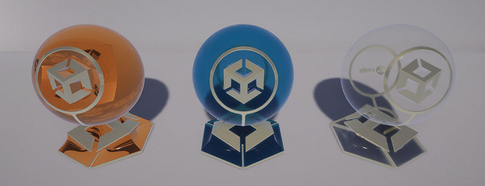

From left to right, a GameObject with **Sphere**, **Box,** and **Thin** mode without path tracing (rasterized).

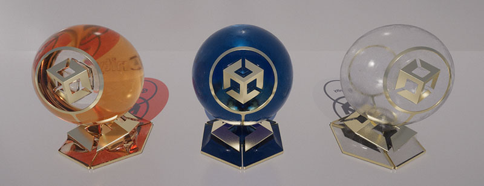

From left to right, a GameObject with **Sphere**, **Box,** and **Thin** mode with path tracing enabled.

### Path tracing and subsurface scattering

For [subsurface scattering's](Subsurface-Scattering.md) **Transmission** property (A) to work correctly with path tracing, you need to do the following:

1. Open the **Surface Options** window.
2. Enable the **Double-Sided** property (B).

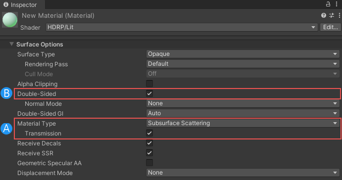

The following example images display a sheet of fabric lit from below by a point light. The first image shows a single-sided surface, and the second shows a double-sided surface:

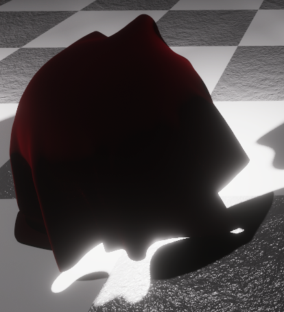

A single-sided surface with Transmission disabled.

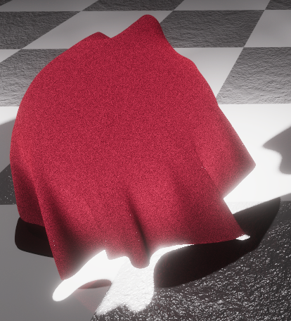

A double-sided surface with Transmission enabled.

## Hair

Path tracing gives human hair a volumetric look. To do this, path tracing calculates the multiple scattering events that happen in a full head of hair. It is particularly effective for lighter hair tones.

You can only use path tracing with hair you create with the [Hair Master Stack](master-stack-hair.md). The Hair Master Stack provides two hair Material Types. Path tracing works with the **Physical** Type.

**Tip:** The second Material Type, **Approximate**, does not work with path tracing. You can learn more about it in [The Approximate Material Type](master-stack-hair.md#hair-approximate).

If you create hair using ribbons, it won’t work with path tracing in Unity. For path tracing to work with hair, you must use cards or tube geometry. For more information, see [Geometry type](master-stack-hair.md\#hair-geometry).

##  Path tracing and automatic histogram exposure
Path tracing creates noise that changes the minimum and maximum values that HDRP uses for automatic, histogram-based [exposure](Override-Exposure.md). You can visualize this when you use the [RGB Histogram](Render-Pipeline-Debug-Window.md#LightingPanel) to debug the exposure in your scene.

This is especially visible in the first few un-converged frames that have the highest level of noise. However, this does not affect the exposure of the final converged frame.

If there is any noise that affects the exposure in the final converged frame, adjust the following properties in the [Automatic Histogram](Override-Exposure.md#AutomaticHistogram) override to set the exposure to your desired range:

* **Limit Min**

* **Limit Max**

## Limitations

This section contains information on the limitations of HDRP's path tracing implementation. Mainly, this is a list of features that HDRP supports in its rasterized render pipeline, but not in its path-traced render pipeline.

### Unsupported features of path tracing

Currently, you can only use HDR path tracing on platforms that use DX12.

HDRP path tracing in Unity 2020.2 has the following limitations:

- If a Mesh in your scene has a Material assigned that does not have the `HDRenderPipeline` tag, the mesh will not appear in your scene. For more information, see [Ray tracing and Meshes](Ray-Tracing-Getting-Started.md#RayTracingMeshes).
- Path tracing in HDRP doesn't support the following:
  - 3D Text and TextMeshPro.
  - Shader Graph nodes that use derivatives (for example, a normal map that derives from a texture).
  - Shader Graphs that use [Custom Interpolators](../../com.unity.shadergraph/Documentation~/Custom-Interpolators.md).
  - Decals.
  - Tessellation.
  - Tube and Disc-shaped Area Lights.
  - Translucent Opaque Materials.
  - Several of HDRP's Materials. This includes Eye, Hair, and Decal.
  - Per-pixel displacement (parallax occlusion mapping, height map, depth offset).
  - MSAA.
  - [Graphics.DrawMesh](https://docs.unity3d.com/ScriptReference/Graphics.DrawMesh.html) or [Graphics.RenderMesh](https://docs.unity3d.com/2022.1/Documentation/ScriptReference/Graphics.RenderMesh.html), because rasterization and ray tracing are different ways of generating an image.
  - [Streaming Virtual Texturing](https://docs.unity3d.com/Documentation/Manual/svt-streaming-virtual-texturing.html).

### Unsupported shader graph nodes for path tracing

When building your custom shaders using shader graph, some nodes are incompatible with ray/path tracing. You need either to avoid using them or provide an alternative behavior using the [ray tracing shader node](SGNode-Raytracing-Quality). Here is the list of the incompatible nodes:
- DDX, DDY, DDXY, NormalFromHeight and HDSceneColor nodes.
- All the nodes under Inputs > Geometry (Position, View Direction, Normal, etc.) in View Space mode.
Furthermore, Shader Graphs that use [Custom Interpolators](../../com.unity.shadergraph/Documentation~/Custom-Interpolators.md) aren't supported in ray/path tracing.

### Unsupported features of ray tracing

For information about unsupported features of ray tracing in general, see [Ray tracing limitations](Ray-Tracing-Getting-Started.md#limitations).
