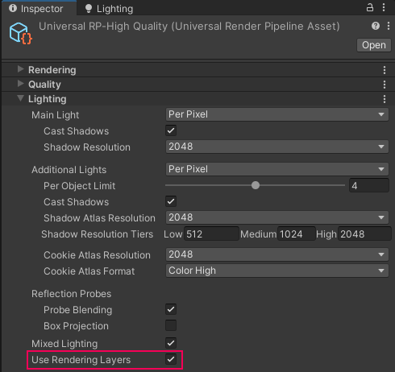
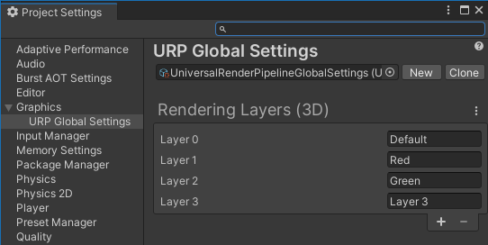
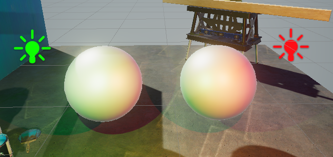
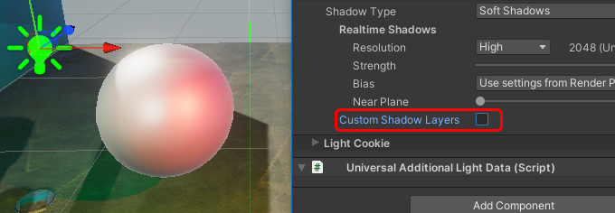
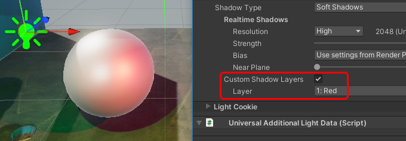
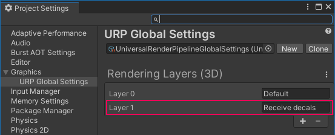

# Rendering Layers

The Rendering Layers feature lets you configure certain Lights to affect only specific GameObjects.

For example, in the following illustration, Light `A` affects Sphere `D`, but not Sphere `C`. Light `B` affects Sphere `C`, but not Sphere `D`.

To read how to implement this example, see section [How to use Rendering Layers](#how-to-rendering-layers).

## Enable Rendering Layers for Lights

To enable Rendering Layers for Lights in your project:

1. In the [URP Asset](../universalrp-asset.md), in the **Lighting** section, click the vertical ellipsis icon (&vellip;) and select **Show Additional Properties**

    

2. In the [URP Asset](../universalrp-asset.md), in the **Lighting** section, select **Use Rendering Layers**.

     *URP Asset > Lighting > Use Rendering Layers*

## Enable Rendering Layers for Decals

To enable Rendering Layers for decals in your project:

1. In the [Decal Renderer Feature](../renderer-feature-decal.md#decal-renderer-feature-properties), enable **Use Rendering Layers**.

     *Decal Renderer Feature, Inspector view.*

When you enable Rendering Layers for Decals, Unity shows the **Rendering Layers** property on each Decal Projector:

## How to edit Rendering Layer names

To edit the names of Rendering Layers:

1. Go to **Project Settings** > **Graphics** > **URP Global Settings**.

2. Edit the Rendering Layer names in the **Rendering Layers (3D)** section.

     *Graphics > URP Global Settings > Rendering Layers (3D)*

## How to use Rendering Layers with Lights

This section describes how to configure the following application example:

* The Scene contains two Point Lights (marked `A` and `B` in the illustration) and two Sphere GameObjects (`C` and `D` in the illustration).

* Light `A` affects Sphere `D`, but not Sphere `C`. Light `B` affects Sphere `C`, but not Sphere `D`.

The following illustration shows the example:

 *Light `A` affects Sphere `D`, but not Sphere `C`. Light `B` affects Sphere `C`, but not Sphere `D`.*

To implement the example:

1. [Enable Rendering Layers](#enable) in your project.

2. Create two Point Lights (call them `A`, and `B`) and two Spheres (call them `C`, and `D`). Position the objects so that both Spheres are within the emission range of Lights.

3. Go to **Project Settings > Graphics > URP Global Settings**. Rename Rendering Layer 1 to `Red`, and Layer 2 to `Green`.

    

4. Select Light `A`, change its color to green. Select Light `B`, change its color to red. With this setup, both Lights affect both Spheres.

    

5. Make the following settings on Lights and Spheres:

    Light `A`: in the property **Light > General > Rendering Layers**, clear all options, and select `Green`.

    Light `B`: in the property **Light > General > Rendering Layers**, clear all options, and select `Red`.

    Sphere `C`: in the property **Mesh Renderer > Additional Settings > Rendering Layer Mask**, select all options, clear `Green`.

    Sphere `D`: in the property **Mesh Renderer > Additional Settings > Rendering Layer Mask**, select all options, clear `Red`.

    Now Point Light `A` affects Sphere `D`, but not Sphere `C`. Point Light `B` affects Sphere `C`, but not Sphere `D`.

    

## How to use Custom Shadow Layers

In the illustration above, Light `A` does not affect Sphere `C`, and the Sphere does not cast shadow from Light `A`.

The **Custom Shadow Layers** property lets you configure the Scene so that Sphere `C` casts the shadow from Light `A`.

1. Select Light `A`.

2. In **Light > Shadows**, select the **Custom Shadow Layers** property. Unity shows the **Layer** property.

3. In the **Layer** property, select the Rendering Layer that Sphere C belongs to.

Now Light `A` does not affect Sphere `C`, but Sphere `C` casts shadow from Light `A`.

The following illustrations show the Scene with the **Custom Shadow Layers** property off and on.

## How to use Rendering Layers with Decals

This section describes how to configure the following application example:

* The Scene contains a Decal Projector.

* The Decal Projector projects a decal on the wall and the ground, but not on the paint bucket.

The following illustration shows the example:

 *In image `1`, the paint bucket has the `Receive decals` layer selected. In image `2` it does not, so the Decal Projector does not project on the bucket.*

To implement the example:

1. [Enable Rendering Layers for Decals](#enable-decals) in your project.

2. [Create a Decal Projector](../renderer-feature-decal.md#how-to-use-the-feature) in the Scene.

3. Go to **Project Settings > Graphics > URP Global Settings**. Add a Rendering Layer called `Receive decals`.

    

4. Select the Decal Projector. In the Rendering Layers property, select `Receive decals`.

    

5. Select the paint bucket GameObject. In the **Rendering Layer Mask** field, clear the `Receive decals` layer. Now the Decal Projector does not affect this GameObject.

## Limitations

This feature has the following limitations:

* Rendering Layers are not supported on OpenGL and OpenGL ES API.

## Performance

This section contains information related to the impact of Rendering Layers on performance.

* Keep the Rendering Layer count as small as possible. Avoid creating Rendering Layers that you don't use in the project.

* When using Rendering Layers for decals, increasing the layer count increases the required memory bandwidth and decreases the performance.

* When using Rendering Layers only for Lights in the Forward Rendering Path, the performance impact is insignificant.

* Performance impact grows more significantly when the Rendering Layer count exceeds a multiple of 8. For example: increasing the layer count from 8 to 9 layers has a bigger relative impact than increasing the layer count from 9 to 10 layers.
